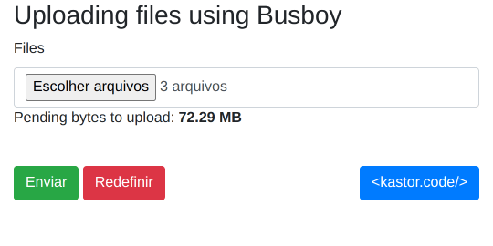

## Upload Multiple Files with Node.js Busboy

> 👷 Developed by Matheus Ramalho de Oliveira  
🔨 Brazilian Software Engineer  
🏡 Goiânia, Goiás, Brasil  
✉️ kastorcode@gmail.com  
👍 [instagram.com/kastorcode](https://instagram.com/kastorcode)

---

  This project uploads multiple independent client files using the Busboy library in Node.js. Communication is in real time via web socket and processing combines the pipeline pattern with streams.

---

### Screenshot

  

---

### Installation and execution

Backend

1. Make a clone of this repository;
2. Create a folder in backend/downloads;
3. Open the backend folder in a terminal;
4. Run `yarn` to install dependencies;
5. Run `yarn start` to start the server at port `3000`.

Frontend

1. Open the frontend folder in a terminal;
2. Run `yarn` to install dependencies;
3. Run `yarn start` to start http server at `http://localhost:8080`.

---

  <big><b>&lt;kastor.code/&gt;</b></big>

